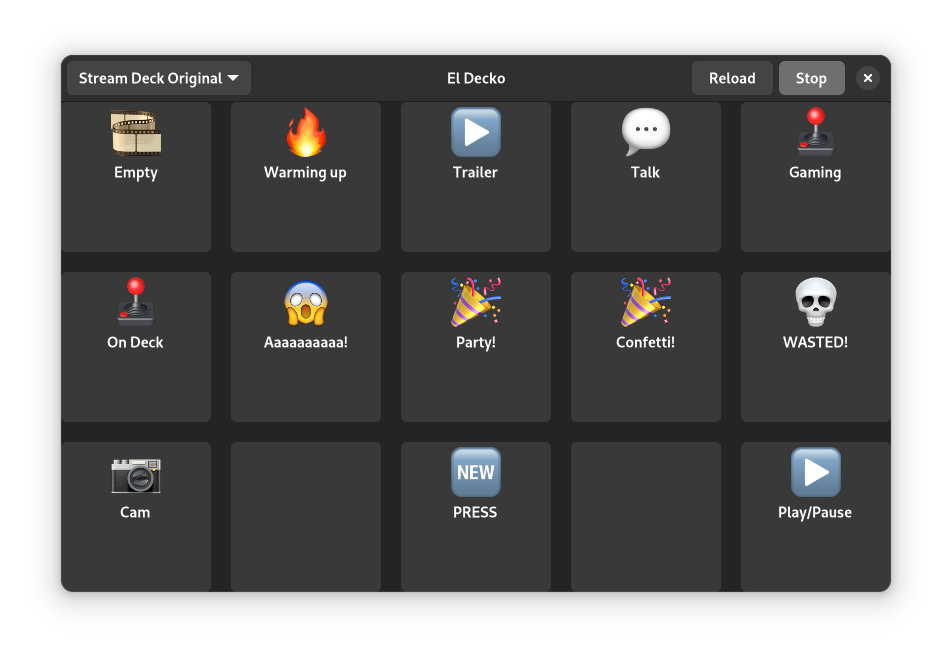

# El Decko GTK4
GTK4 based user interface for El Decko

**v 2023.5.8:**

## requirements
- typelib-1_0-Adw-1

## Features
- Start/Stop/Reload ed-core
- Loads and displays Elgato Stream Deck button configs

### ToDo:
- Change actual button configuration
  - Set image
  - Set Label
  - Set Action
- Rebuild grid view upon selecting another Stream Deck
- Sidebar for button configuration