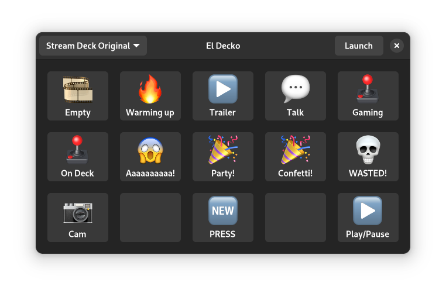

# El Decko GTK4
GTK4 based user interface for [El Decko](https://github.com/Z-Ray-Entertainment/el-decko)

**v 2023.5.8:**

## requirements
- typelib-1_0-Adw-1
- El Decko Core >= 2023.5.8
- PyGObject >= 3.42.2

## Features
- Start/Stop/Reload ed-core
- Loads and displays Elgato Stream Deck button configs
  - image_idle and label

### ToDo:
- Change actual button configuration
  - Set image
  - Set Label
  - Set Action
- Rebuild grid view upon selecting another Stream Deck
- Sidebar for button configuration
